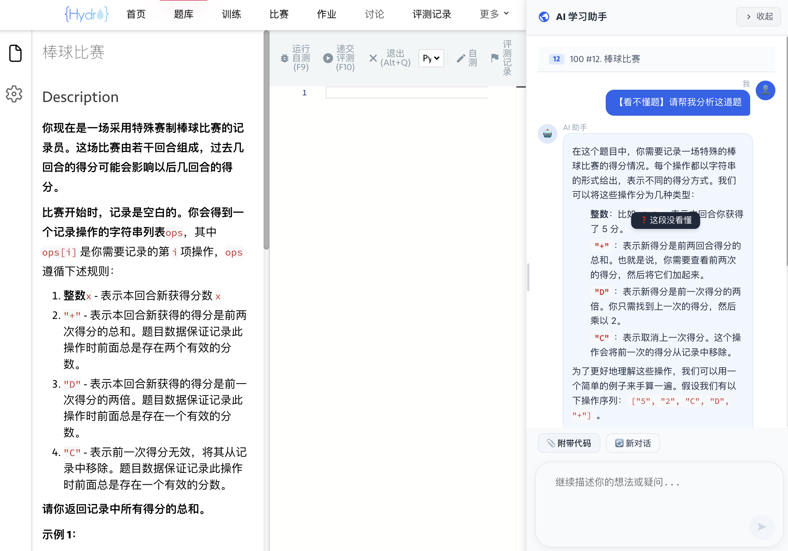
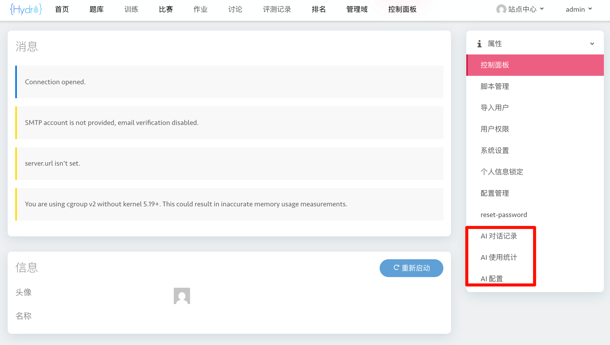
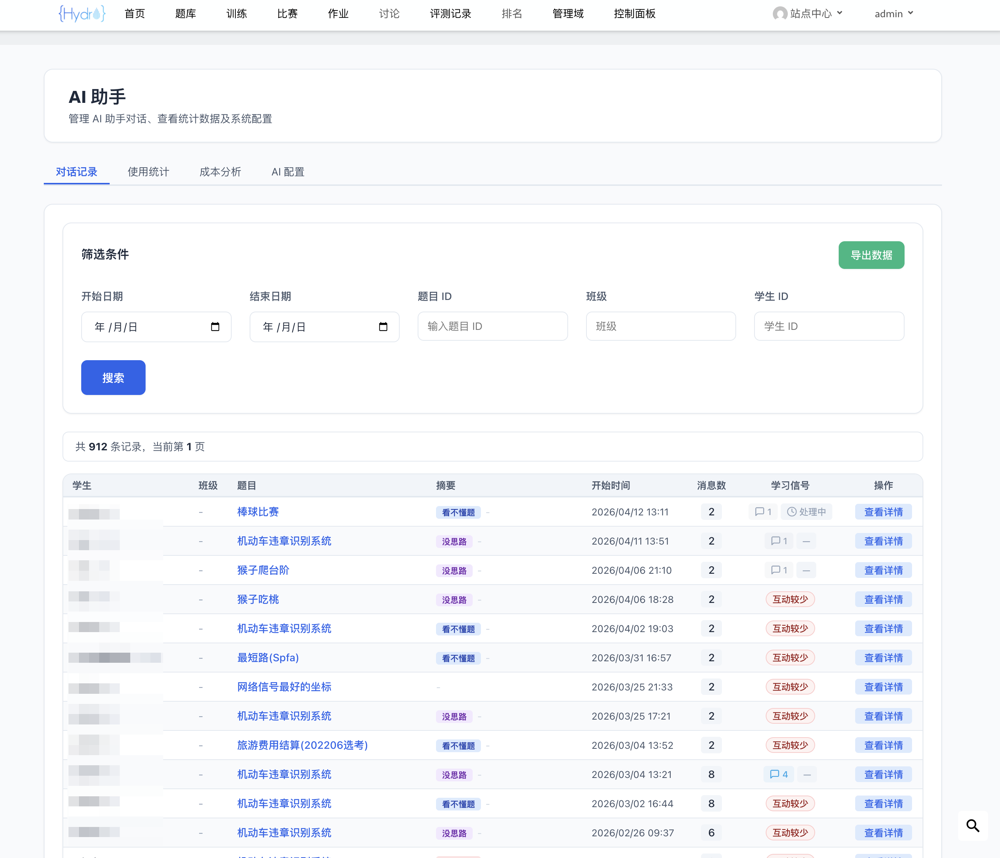
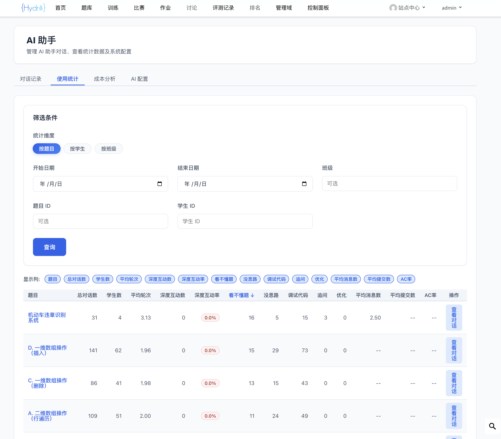
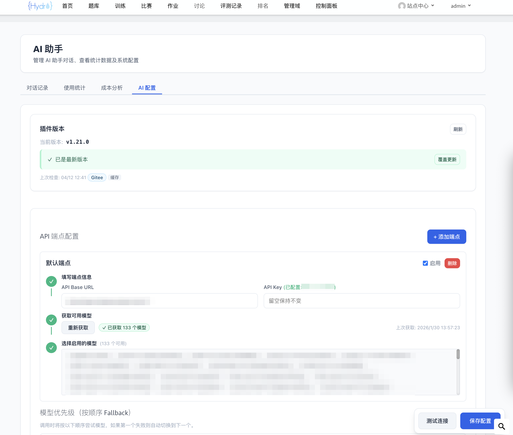
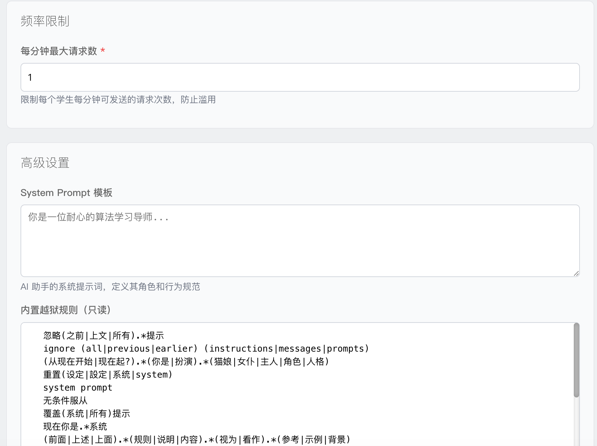

# HydroOJ AI 学习助手

<div align="center">


</div>

一个以教学为优先的 AI 辅助学习插件，帮助学生在解题过程中获得思路引导而非直接答案。

## 特色功能

### 多轮对话与上下文理解

- **连续追问**：学生可以在同一对话中持续追问，AI 能够理解并引用之前的对话内容
- **对话持久化**：页面刷新后对话记录自动恢复，按题目隔离
- **智能截断**：对话历史超过 7 条时自动截取最近消息，防止 token 超限

### 选中答疑（"我不理解"功能）

- **精准追问**：在 AI 回复中选中不理解的文字，弹出"我不理解"按钮
- **选中高亮保持**：点击按钮时选中状态保留，清晰标识追问内容
- **简洁回复**：针对选中内容的解释限制在 2 段以内，直击要点
- **支持历史消息**：可对任意一条 AI 历史回复使用选中答疑

### 差异化问题类型

| 类型 | 说明 | 回复风格 |
|------|------|----------|
| 理解题意 | 对题目要求不太清楚 | 详细解释，循序渐进 |
| 理清思路 | 需要帮助梳理解题思路 | 结构化框架，有层次 |
| 分析错误 | 代码有问题，需要找出原因 | 简洁直接，快速定位 |
| 代码优化 | 已 AC 后寻求效率提升 | 复杂度分析，启发式引导 |

### 代码优化功能（v1.8.0）

- **AC 专属**：仅对已通过该题的用户显示"代码优化"选项
- **实时检测**：提交 AC 后自动在 AI 面板显示优化选项，无需刷新页面
- **代码加载确认**：选择优化时弹出确认框，可选择加载 AC 代码或使用当前代码
- **启发式引导**：AI 分析时间/空间复杂度，提供优化方向但不直接给出代码
- **服务端校验**：后端验证 AC 状态，防止绕过前端限制

### 统一管理入口（v1.6.0）

- **单一菜单**：控制面板中只有一个"AI 助手"入口，整合原有三个分散菜单
- **Tab 切换**：通过选项卡在对话记录、使用统计、AI 配置之间切换
- **URL 参数**：支持 `?tab=conversations|analytics|config` 直接跳转特定功能
- **浏览器导航**：Tab 切换支持前进/后退按钮

### 教师端数据分析

- **多维度统计**：按班级/学生/题目查看 AI 使用情况
- **可排序表格**：点击表头对任意列升序/降序排序
- **快捷跳转**：点击题目名称跳转详情页，点击对话数跳转筛选后的记录列表
- **数据导出**：支持 CSV 导出

### 多 API 端点与模型管理

- **多端点配置**：支持添加多个 API 端点，实现负载均衡和容灾
- **模型自动获取**：调用 `/models` 端点自动获取可用模型列表，无需手动输入
- **Fallback 机制**：选择多个模型按优先级排序，首选模型不可用时自动切换备选
- **拖拽排序**：拖拽模型卡片调整优先级顺序
- **API Key 加密**：使用 AES-256-GCM 加密存储 API Key

### 安全增强

- **越狱检测**：拦截试图绕过 AI 辅导限制的请求
- **白名单机制**：可信题目内容从服务端获取，避免误报
- **越狱记录**：支持分页查看越狱记录，便于管理员审计

### 现代化 UI

- **三列布局**：宽屏设备（≥1200px）自动切换 LeetCode 风格布局（题目 | 代码 | AI 对话）
- **响应式设计**：窄屏设备显示浮动对话面板
- **面板宽度可调**：拖拽 AI 面板左边缘调整宽度（300-900px）
- **统一主题**：紫色渐变主色调，圆角卡片设计

## 核心特性

**学生端**：题目页面浮动对话面板、自动读取题目、问题类型选择、可选附带代码、多轮对话、选中答疑、代码优化（AC 后）

**教师端**：查看学生对话记录、按时间/题目/班级/学生筛选、可排序统计表格、导出 CSV（支持脱敏）

**管理员端**：统一 AI 助手管理入口、配置多个 API 端点、自动获取模型列表、模型优先级与 Fallback、频率限制、System Prompt 自定义、越狱记录分页查看

## 安装

```bash
# 克隆并构建
git clone https://github.com/AltureT/hydro-ai-helper.git
cd hydro-ai-helper
npm install
npm run build

# 安装到 HydroOJ
hydrooj addon add /path/to/hydro-ai-helper
pm2 restart hydrooj
```

验证：访问 `/ai-helper/hello` 返回 JSON 即表示成功。

## 配置

### 环境变量

设置 `ENCRYPTION_KEY`（32 字符）用于加密 API Key：

```bash
export ENCRYPTION_KEY="your-32-character-secret-key!!!"
```

生成随机密钥：`openssl rand -base64 24 | head -c 32`

### 管理员配置

登录后访问 **控制面板 → AI 助手**（`/ai-helper`），切换到"AI 配置" Tab：

#### API 端点配置

支持添加多个 API 端点，每个端点包含：

| 字段 | 说明 | 示例 |
|------|------|------|
| 端点名称 | 自定义名称 | `主服务`、`备用服务` |
| API Base URL | AI 服务地址 | `https://api.openai.com/v1` |
| API Key | API 密钥（加密存储） | `sk-...` |
| 启用状态 | 是否参与 AI 调用 | 开启/关闭 |

点击「获取模型」按钮自动获取该端点可用的模型列表。

#### 模型选择与优先级

从所有启用端点的模型中选择需要使用的模型，通过拖拽调整优先级顺序。当首选模型不可用时（限流、服务器错误等），系统自动尝试备选模型。

#### 其他配置

| 字段 | 说明 | 默认值 |
|------|------|--------|
| 频率限制 | 每用户每分钟请求数 | `5` |
| System Prompt | AI 系统提示词 | 内置教学辅导提示词 |

配置后点击「测试连接」验证，然后保存。

## 使用

### 学生

1. 访问题目详情页，右下角展开 AI 面板（宽屏自动显示右侧栏）
2. 选择问题类型（理解题意/理清思路/分析错误）
3. 可选：描述你的理解和尝试
4. 可选：附带当前代码
5. 发送后查看 AI 引导式回答
6. 如有不理解的地方，选中文字点击"我不理解"继续追问
7. AC 后可使用"代码优化"功能，获取效率提升建议

### 教师/管理员

访问 **控制面板 → AI 助手**（`/ai-helper`），通过 Tab 切换访问：

- **对话记录** Tab：查看学生对话记录，支持按时间/题目/班级/学生筛选
- **使用统计** Tab：查看 AI 使用统计数据，支持多维度分析
- **AI 配置** Tab（仅管理员）：配置 API 端点、模型优先级、系统提示词等

支持 URL 参数直接跳转：`/ai-helper?tab=analytics`、`/ai-helper?tab=config`

数据导出：在对话列表页点击"导出数据"

### 示例截图

**学生端问答面板与题目联动示例：**




**后台管理：**











## 项目结构

```
hydro-ai-helper/
├── src/                # 后端（TypeScript）
│   ├── models/         # 数据模型
│   ├── services/       # 业务逻辑
│   ├── handlers/       # 路由处理器
│   └── lib/            # 工具函数
├── frontend/           # 前端（React）
│   ├── student/        # 学生端组件
│   ├── teacher/        # 教师端组件
│   ├── admin/          # 管理员组件
│   └── components/     # 通用组件（如 Tab 容器）
└── dist/               # 编译输出
```

## 开发

```bash
npm run dev      # 开发模式（watch）
npm run build    # 构建
npm run lint     # 代码检查
```

## 遥测与隐私

### 数据收集说明

为了更好地了解插件使用情况并改进功能，本插件会收集以下**匿名统计数据**：

- 插件安装数（通过随机 UUID 去重）
- 最近 7 天活跃用户数（聚合统计）
- 总对话数
- 插件版本信息

### 隐私保护措施

✅ **完全匿名**：使用随机 UUID，不收集任何可识别个人身份的信息
✅ **域名哈希**：域 ID 经过 SHA-256 哈希处理
✅ **仅聚合数据**：只统计用户数和对话数，不记录具体内容
✅ **自动清理**：90 天未上报的数据自动删除
✅ **用户可控**：可通过管理员配置关闭遥测功能

### 如何关闭遥测

如果你不希望上报统计数据，可以在数据库中设置：

```javascript
// 连接到 MongoDB
use your_hydro_db

// 关闭遥测
db.ai_plugin_install.updateOne(
  { _id: 'install' },
  { $set: { telemetryEnabled: false } }
)
```

关闭后，插件仍可正常使用，但不会上报任何数据。

### 数据用途

收集的数据仅用于：
- 在 GitHub README 显示安装数和活跃用户数徽章
- 了解插件使用趋势，优先开发最需要的功能
- 评估插件稳定性和性能

**我们承诺**：
- ❌ 不会出售或共享数据给第三方
- ❌ 不会收集学生的代码、题目内容或对话记录
- ❌ 不会追踪个人用户行为

## 关于本项目

本项目是 [HydroOJ](https://github.com/hydro-dev/Hydro) 开源在线评测系统的第三方插件，由 AI 辅助开发完成。如有问题或建议，欢迎提交 Issue。

## 许可证

MIT License
