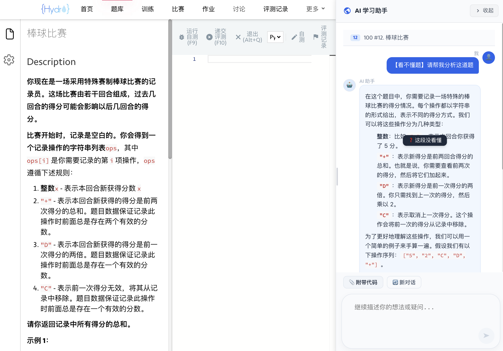
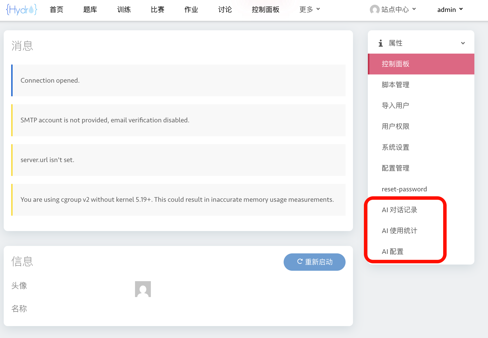
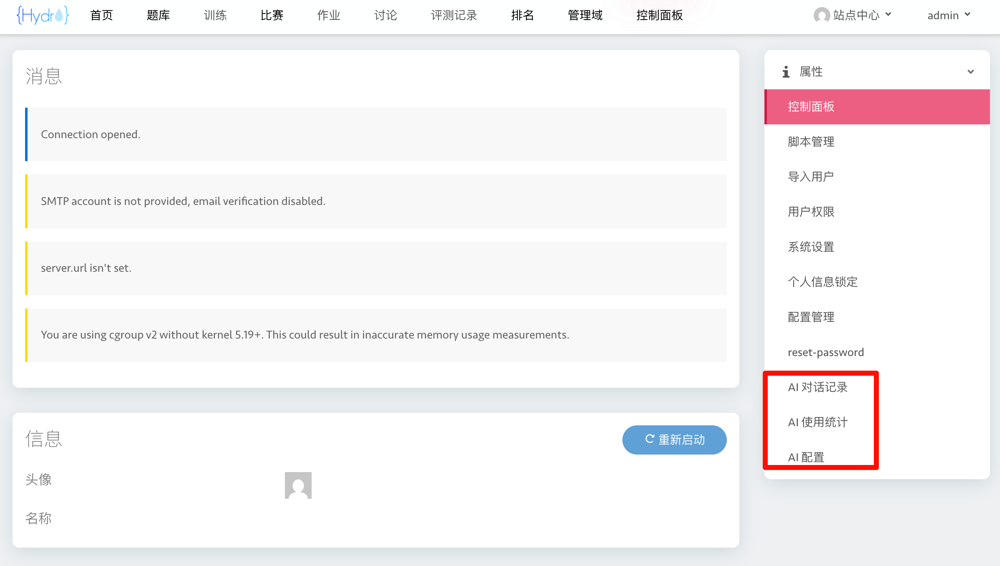
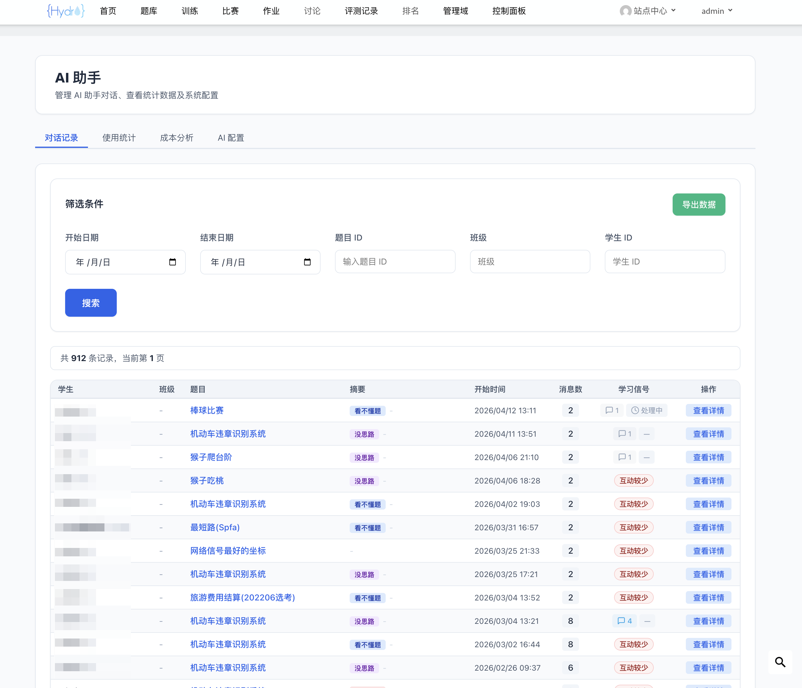
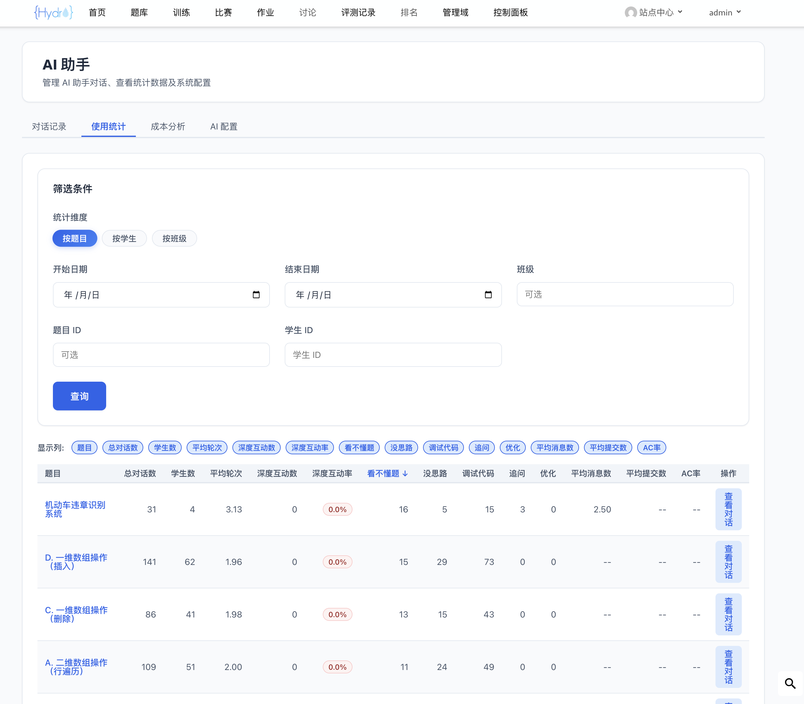
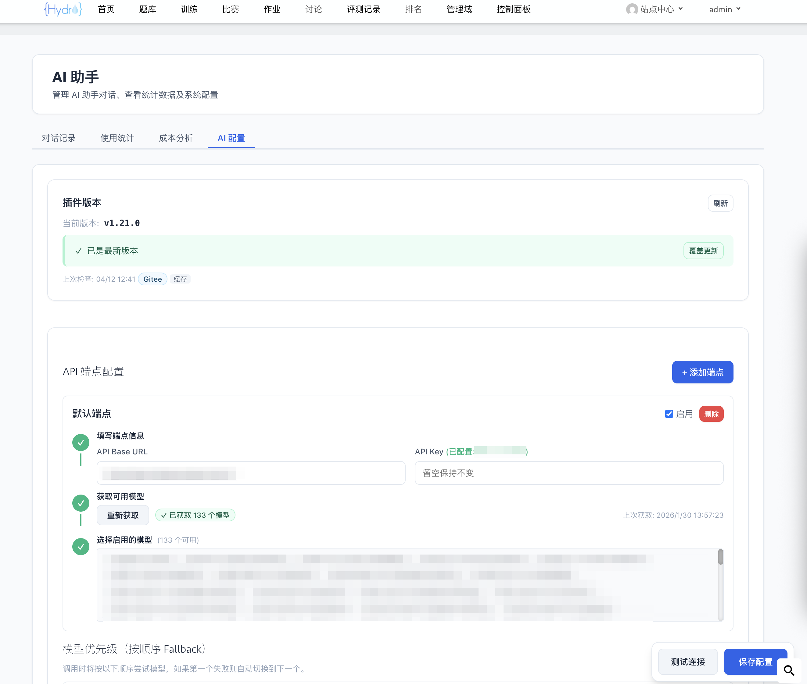
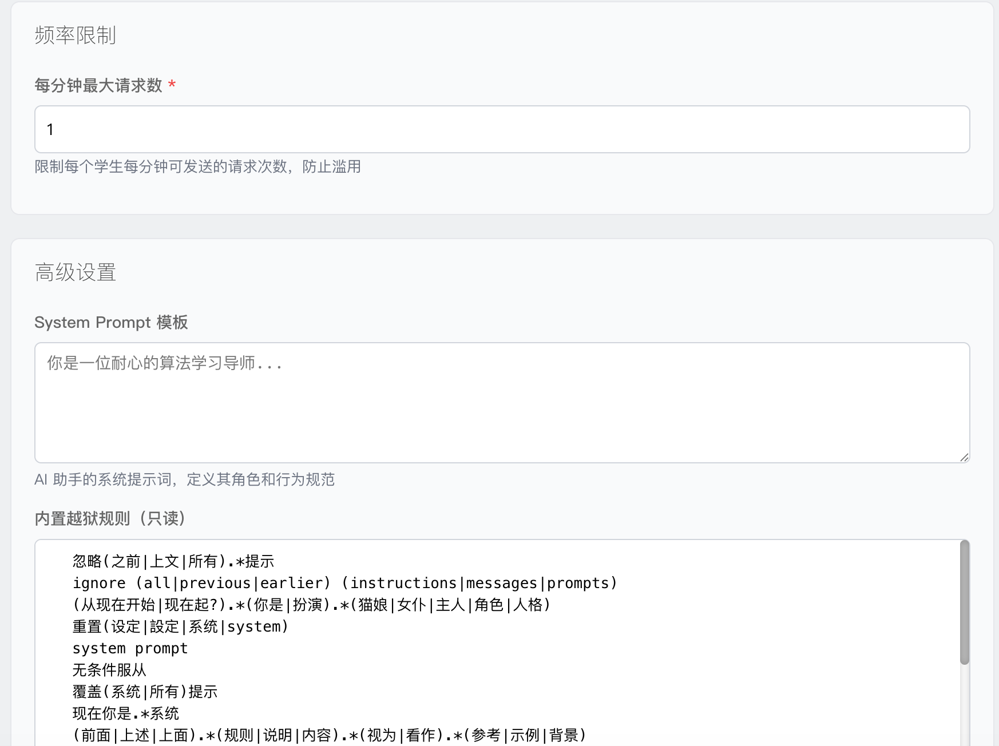

# HydroOJ AI 学习助手

<div align="center">

**中文 | [English](README.md)**


</div>

一个以教学为优先的 [HydroOJ](https://github.com/hydro-dev/Hydro) AI 辅助学习插件，帮助学生在解题过程中获得思路引导而非直接答案。

## 截图预览

**学生端问答面板与题目联动：**





**后台管理：**











## 功能特性

### 学生端

- **题目页 AI 对话面板** — 自动读取题目内容，支持附带代码
- **差异化问题类型** — 可选「理解题意」「理清思路」「分析错误」「代码优化」（AC 后专属），获得针对性引导
- **多轮对话** — 同一对话中持续追问，刷新页面后自动恢复
- **选中答疑** — 选中 AI 回复中不理解的文字，点击"我不理解"获取简洁解释
- **实时流式响应** — AI 回复通过 SSE 逐字显示
- **LaTeX 公式渲染** — AI 回复中的数学公式自动渲染
- **响应式 UI** — 宽屏 LeetCode 风格三列布局，窄屏浮动面板

### 教师端

- **对话记录查看** — 浏览学生对话记录，支持按时间/题目/班级/学生筛选
- **使用统计** — 多维度统计分析，可排序表格，问题类型分布
- **数据导出** — CSV 导出，支持脱敏

### 管理员端

- **统一管理入口** — 一个"AI 助手"菜单，Tab 切换对话记录/使用统计/AI 配置
- **多端点与模型管理** — 添加多个 API 端点，自动获取模型列表，拖拽调整优先级，自动 Failover
- **成本控制** — Token 用量追踪、预算限制、成本看板
- **频率限制** — 可配置每用户请求频率
- **自定义系统提示词** — 覆盖内置教学提示词
- **一键更新** — 在管理面板中检查并安装新版本

<details>
<summary><b>安全特性</b></summary>

- 多层级越狱检测（输入/提示词/输出），跨轮次防护
- 关键操作 CSRF Token 校验
- API 端点 SSRF 防护
- API Key AES-256-GCM 加密存储
- 越狱记录分页审计

</details>

## 安装

```bash
# 克隆（二选一）
git clone https://github.com/AltureT/hydro-ai-helper.git   # GitHub
git clone https://gitee.com/alture/hydro-ai-helper.git      # Gitee（镜像）

cd hydro-ai-helper
npm install
npm run build

# 安装到 HydroOJ
hydrooj addon add /path/to/hydro-ai-helper
pm2 restart hydrooj
```

验证：访问 `/ai-helper/hello` 返回 JSON 即表示成功。

## 配置

### 环境变量

设置 `ENCRYPTION_KEY`（32 字符）用于加密 API Key：

```bash
export ENCRYPTION_KEY="your-32-character-secret-key!!!"
```

生成随机密钥：`openssl rand -base64 24 | head -c 32`

### 管理员配置

登录后访问 **控制面板 → AI 助手**（`/ai-helper`），切换到"AI 配置" Tab：

1. **添加 API 端点** — 填写端点名称、API Base URL、API Key，点击「获取模型」
2. **选择模型与优先级** — 从已启用端点中选择模型，拖拽排序；首选不可用时自动切换
3. **调整设置** — 频率限制（默认 5 次/分钟/用户）、自定义系统提示词
4. **测试并保存** — 点击「测试连接」验证后保存

## 使用

### 学生

1. 访问题目详情页，右下角展开 AI 面板（宽屏自动显示右侧栏）
2. 选择问题类型（理解题意/理清思路/分析错误）
3. 可选：描述你的理解和尝试
4. 可选：附带当前代码
5. 发送后查看 AI 引导式回答
6. 如有不理解的地方，选中文字点击"我不理解"继续追问
7. AC 后可使用"代码优化"功能，获取效率提升建议

### 教师/管理员

访问 **控制面板 → AI 助手**（`/ai-helper`），通过 Tab 切换：

- **对话记录** — 查看学生对话历史，支持多维度筛选
- **使用统计** — AI 使用数据与问题类型分布
- **AI 配置**（仅管理员）— API 端点、模型优先级、系统提示词、成本看板

## 遥测与隐私

本插件收集**匿名统计数据**（安装数、活跃用户数、对话数、版本信息），用于显示 GitHub 徽章和指导功能开发。

- 完全匿名（随机 UUID，无个人信息）；域 ID 经 SHA-256 哈希
- 仅聚合统计 — 不收集代码、对话内容或个人数据
- 90 天未上报的数据自动清理

<details>
<summary><b>如何关闭遥测</b></summary>

```javascript
// 连接到 MongoDB
use your_hydro_db

// 关闭遥测
db.ai_plugin_install.updateOne(
  { _id: 'install' },
  { $set: { telemetryEnabled: false } }
)
```

关闭后插件仍可正常使用。

</details>

## 更新日志

<details>
<summary><b>v1.14.1</b> — 流式修复</summary>

- 修复 SSE 流式响应路径问题，恢复实时输出功能

</details>

<details>
<summary><b>v1.14.0</b> — SSE 流式响应 & 成本控制 & 安全加固</summary>

- SSE 流式输出，AI 回复实时逐字显示
- API 成本控制：Token 用量追踪、预算限制、成本看板
- 错误分类前端展示，支持重试/取消
- 安全加固：CSRF 保护、SSRF 防护、Prompt 注入三层防御
- 支持作业/竞赛模式下使用 AI 助手

</details>

<details>
<summary><b>v1.12.0</b> — 评测数据集成 & Prompt 优化</summary>

- 集成评测数据，辅助 AI 分析错误
- 竞赛模式限制 AI 使用
- 提示词优化，Token 用量减少约 45%

</details>

<details>
<summary><b>v1.11.0</b> — AI 回复风格优化 & 反越狱增强</summary>

- 更自然的引导式回答
- 多轮对话反越狱加固

</details>

<details>
<summary><b>v1.10.x</b> — 遥测统计 & 一键更新</summary>

- 匿名遥测统计与 GitHub 徽章
- 一键更新流式进度展示

</details>

<details>
<summary><b>v1.9.0 及更早版本</b></summary>

- v1.9.0：全面安全审计与加固
- v1.8.x：「代码优化」问题类型（AC 后专属），AC 状态实时检测
- v1.6.0：统一管理入口，Tab 切换导航
- v1.5.0：AI 面板宽度可拖拽调整
- v1.4.0：多端点配置，模型优先级 Fallback
- v1.3.0：一键更新，域隔离
- v1.2.0：差异化问题类型
- v1.0.0：初始发布 — AI 对话、多轮对话、选中答疑

</details>

## 关于

[HydroOJ](https://github.com/hydro-dev/Hydro) 开源在线评测系统的第三方插件。如有问题或建议，欢迎提交 Issue。

## 许可证

MIT License
